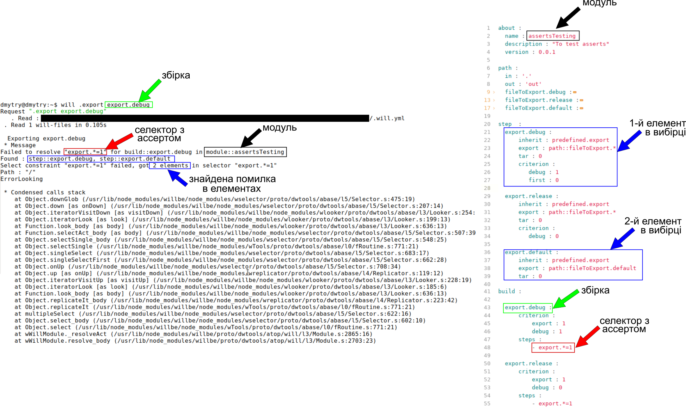

# Як використовувати ассерти в will-файлі

В туторіалі пояснюється як з допомогою ассертів зменшити кількість помилок в `will`-файлі  

<a name="assert-term"></a>

`Willbe` - система структурування данних, адже, і `will`-файл, і сам модуль будується за визначеними правилами. Саме тому при побудові `will`-файла (і системи, відповідно) потрібно виключити логічні помилки, найпоширенішою з яких є одночасне співпадання декількох ресурсів в вибірці селектора.  
Лінійна збірка, як завантаження підмодуля або встановлення пакетів зовнішньою програмою, має чітку послідовнісь і виключає логічні помилки, але в попередніх прикладах ми бачили, як зростає число ресурсів при додаванні нових умов. Тому потрібно ввести самодіагностику кількості входжень ресурсів в вибірку. Для цього в пакеті `willbe` використовуються ассерти (_asserts_).  
Ассерти в пакеті використовуються разом з ґлобами, оскільки останні є умовою порівняння мапи критеріонів. Ассерт записуєтся після ґлобу та має вигляд _'=n'_, де _'n'_ позначає кількість входженнь. Для підтвердження вибору одного ресурса всередині `will`-файла використовується ассерт '=1'.  

### <a name="how-assert-works"></a> Як працють ассерти
Змінимо попередній `will`-файл так, щоб вибірка одночасно включала декілька варіантів:

<details>
    <summary><u><em>Лістинг `.will.yml`</em></u></summary>

```yaml

about :

  name : assertsTesting
  description : "To test asserts"
  version : 0.0.1

path :

  in : '.'
  out : 'out'
  fileToExport.debug :
    criterion :
       debug : 1
    path : './fileDebug'

  fileToExport.release :
    criterion :
       debug : 0
    path : './fileRelease'
    
  fileToExport.default :
    path : './fileDefault'    

step  :
  export.debug :
      inherit : predefined.export
      export : path::fileToExport.*
      tar : 0
      criterion :
         debug : 1

  export.release :
      inherit : predefined.export
      export : path::fileToExport.*
      tar : 0
      criterion :
         debug : 0
  
  export.default :
      inherit : predefined.export
      export : path::fileToExport.default
      tar : 0

build :

  export.debug :
      criterion :
          export : 1
          debug : 1
      steps :
          - export.*

  export.release :
      criterion :
          export : 1
          debug : 0
      steps :
          - export.*

```

</details>

Введемо фразу `will .export export.debug` в кореневій директорії файла `.will.yml`:

```
[user@user ~]$ will .export export.debug
...
  Exporting export.debug
 * Message
Cant find step export.*   

 * Condensed calls stack
...
(Error message)

```

`Willbe` не знайшов крок `export.*`, хоча маємо три. Додамо в збірку `export.debug` ассерт до кроку та повторимо ввід команди:

```yaml
build :

  export.debug :
      criterion :
          export : 1
          debug : 1
      steps :
          - export.*=1

```

<details>
    <summary><u><em>Лог помилки та `will`-файл</em></u></summary>



</details>


<a name="assert-failure-information"></a>

Ця інформація вказує, що допущена помилка в збірці `export.debug` - знайдено два кроки `Found : step::export.debug, step::export.default`, а очікувався один - її потрібно виправити. В порівнянні з попереднім логом, ми маємо дані про помилку в визначених ресурсах, що спрощує корегування файла. Для того, щоб виправити помилку необхідно зробити ресурс унікальним - змінити назву і додати відповідну збірку або ж змінити мапу критеріонів.  
Висновок: ресурс підтверджує істинність критеріонів, які не вказані в ньому. Тому, пакет `willbe` зчитав крок `export.default` як дійсний за відсутністю критеріона `debug`.  
Ми створювали окремі збірки, тепер використаємо критеріони. Уявімо, що крок `export.default` виконується зі встановленим критеріоном `debug` і додатково повинен мати критеріон `first`. Приведіть відповідні секції і ресурси до вигляду:

```yaml
step  :
  export.debug :
      inherit : predefined.export
      export : path::fileToExport.*
      tar : 0
      criterion :
         debug : 1
         first : 0

  export.default :
      inherit : predefined.export
      export : path::fileToExport.default
      tar : 0
      criterion :
          debug : 1
          first : 1

build :

  export.debug.first :
      criterion :
          export : 1
          debug : 1
          first : 1
      steps :
          - export.*=1

```

Створіть файл `fileDefault` в кореневій директорії `.will.yml` та запустіть `will .export export.debug.first`

```
[user@user ~]$ will .export export.debug.first
...
Exporting export.debug.first
   + Write out will-file /path_to_file/out/assertsTesting.out.will.yml
   + Exported export.debug.first with 1 files in 1.455s
  Exported export.debug.first in 1.513s

```

- Отже, ассерти потрібні для підтвердження правильності виконання програми, а також вони дозволяють [швидко локалізувати помилки в `will`-файлі](#assert-failure-information)

[Наступний туторіал](MinimizationOfWillFile.ukr.md)  
[Повернутись до змісту](../README.md#tutorials)