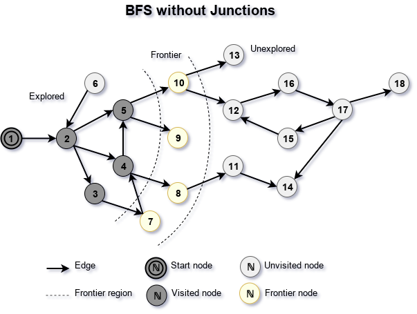
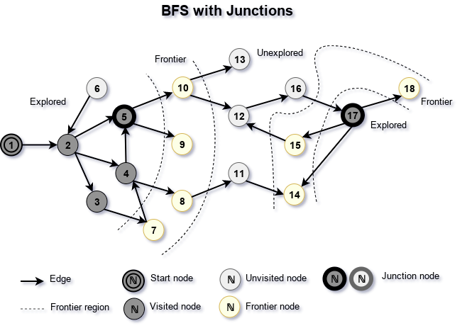

## Junction

The junction is a relation between two or more nodes of a graph, making algorithms treat those distinct nodes as the same node.

Nodes connected with a junction are called variants of the junction, or variants of the node. A junction can be used to join several unconnected graphs into one connected graph or to add short-cut from one location in the graph to another. Junction and edge are different concepts. The junction is undirected. Edge does not turn different nodes into one node.

### Implementation

The introduction of junctions let traverse more complex graphs in which several nodes could represent the same entity. We implemented junction introducing three custom callbacks to the class AbstractNodesGroup:

- onNodeJunction
- onJunctionIs
- onJunctionNodes

Graph supporting junctions should define callback onNodeJunction for its instance of class AbstractNodesGroup; otherwise it treated as graph not supporting junctions. Callback onNodeJunction should return junction for a node. It is assumed that calls of callback onNodeJunction return the same instance of the junction, but object AbstractNodesGroup does not have no state related to junctions, so such restriction is only relevant during the execution of ( any ) algorithm of AbstractNodesGroup. Inbetween two run of an algorithm configuration of the graph is allowed to be changed as well as result of onNodeJunction for a specific node.

Callbacks onJunctionIs and onJunctionNodes are optimal. Callback onJunctionIs answers question "is it a junction". Default implementation of callback onJunctionIs returns "maybe" for each input argument except undefined and null. Callback onJunctionNodes gives a list of all variants of the junction. There is no default implementation of onJunctionNodes. If callback onJunctionNodes is not provided, then algorithms try to deduce it. If callback onJunctionNodes is provided, then algorithms that use this callback works faster.

Implementations of graph algorithms realize the concept with the help of callback onEvaluate of lower-level general functions, like container.appendOnce and other. Many methods of containers supports callback onEvaluate what makes the process of implementation of concept junction easier.  Callback onEvaluate evaluates an element of a container returning its value for comparison with another element. The prime application of callback onEvaluate has been sorting and searching algorithms.

### Demonstration

Let's look at how adding junction to a random graph changes outcomes of the breadth-first search algorithm.

On diagram "Bfs without junctions" you may see run of BFS on a graph without any junction.

Adding junction between nodes 5 and 17 to the graph changes the course of the algorithm. You may see it on the diagram "Bfs with junctions". Joining nodes 5 and 17 into junction makes to spread of frontier as if those nodes where one.

[Back to content](../README.md#Concepts)
