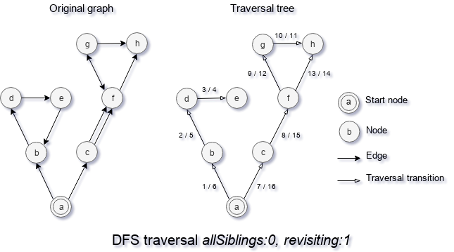
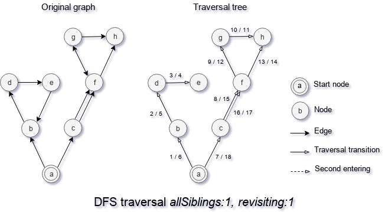

## All-siblings strategy

The all-siblings strategy of a search algorithm is a strategy to handle cases when a node A has multiple edges to a node B. Unlike revisiting strategy which controls how to handle the second instance of a node on different depth all-siblings strategy controls how to handle the second instance of a node on the same depth.

This strategy is an option for such search algorithms as DFS, BFS, CFS.

### AllSiblings : 0

You may see how DFS with all-siblings strategy `allSiblings : 0` works on the diagram "DFS traversal allSiblings:0, revisiting:1", where an original graph is on the left side and traversal tree of the graph on the right side. The [`revisiting`](./StrategyRevisiting.md) option uses to show the difference in a search algorithm.

With all-siblings strategy, `allSiblings : 0` search algorithm uses only one edge from one to another node and ignores all duplicates. As you may see, the second edge `cf` is never used because the algorithm treated two edges `cf` as one edge.

### AllSiblings : 1

You may see how DFS with all-siblings strategy `allSiblings : 1` works on the diagram "DFS traversal allSiblings:1, revisiting:1", where an original graph is on the left side and traversal tree of the graph on the right side.

Strategy `allSiblings : 1` allows algorithm revisit node of the graph if it has a few edges from the parent node. But unlike `allSiblings : 2`, there does not take place getting deeper than that. As you may see, the algorithm revisits node `f` and get back to `c` because without going in depth the second time.

### AllSiblings : 2

You may see how DFS with strategy `allSiblings : 2` works on the diagram "DFS traversal allSiblings:2, revisiting:1", where an original graph is on the left side and traversal tree of the graph on the right side.

Strategy `allSiblings : 2` works similar to strategy `allSiblings : 1`, but when the algorithm revisits a child node, it continues the traversal in depth. As you may see, the algorithm revisits node `f` and continues the traversal to nodes `g` and `h`. So such a search is the slowest among 3.

[Back to content](../README.md#Concepts)
