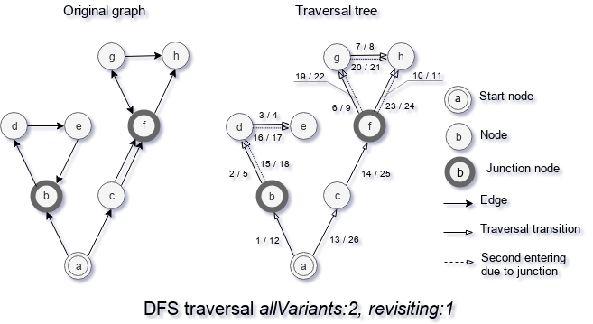

## All-variants strategy

The all-variants strategy of a search algorithm is a strategy to handle cases when a node A has junction to a node B. Unlike revisiting and all-siblings strategies which control how to handle connected nodes, all-variants strategy controls how to handle junction nodes without direct connection.

This strategy is an option for such search algorithms as DFS, BFS, CFS.

### AllVariants : 0

You may see how DFS with all-revisiting strategy `allVariants : 0` works on the diagram "DFS traversal allVariants:0, revisiting:1", where an original graph is on the left side and traversal tree of the graph on the right side. The [`revisiting`](./StrategyRevisiting.md) option uses to show difference in search algorithm.

With all-variants strategy `allVariants : 0` search algorithm uses only connected node and ignores the fact that graph has junction nodes. As you may see, after the walk `bde` algorithm continues the walk to node `c` and does not visit node `f`.

### AllVariants : 1

You may see how DFS with all-variants strategy `allVariants : 1` works on the diagram "DFS traversal allVariants:1, revisiting:1", where an original graph is on the left side and traversal tree of the graph on the right side. 

Strategy `allVariants : 1` allows algorithm revisit junction nodes of the graph. But unlike `AllVariants : 2`, there does not take place getting deeper than that. As you may see, the algorithm revisits node `f` and get back to `c` because without going in depth the second time.

### AllVariants : 2

You may see how DFS with all-variants strategy `allVariants : 2` works on the diagram "DFS traversal allVariants:2, revisiting:1", where an original graph is on the left side and traversal tree of the graph on the right side.

Strategy `allsVariants : 2` works similar to strategy `AllVariants : 1`, but when the algorithm revisits a junction node, it continues the traversal in depth. As you may see, the algorithm revisits node `f` and continues the traversal to junction node `b`. So such a search is the slowest among 3.

[Back to content](../README.md#Concepts)
