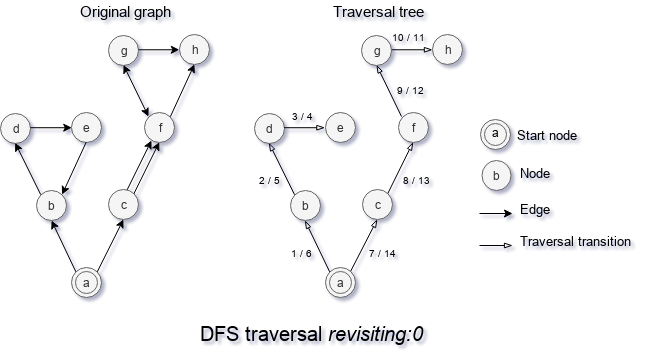
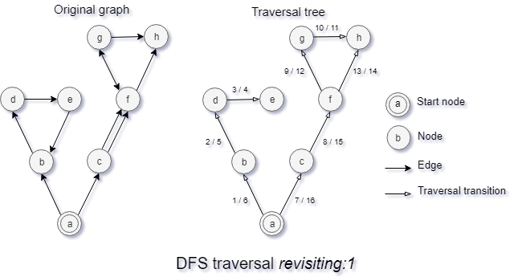
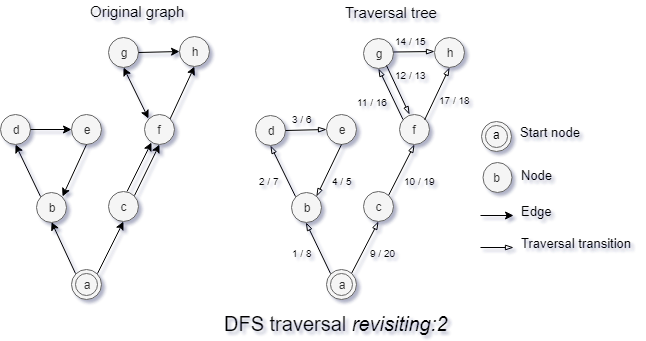
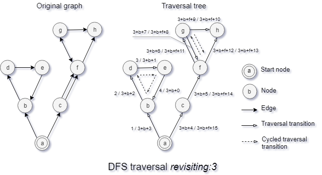

## Revisiting strategy

The revisiting strategy of a search algorithm is a strategy to handle multiple encountering of a node.

There are multiple strategies for visiting a node in a cycle. Search option revisiting manages search algorithms aspect of revisiting node. The simplest two scenarios are avoiding second visiting of a node, `revisiting : 0` does exactly that and ignoring the fact that graph can have a cycle, `revisiting : 3` does precisely that.

This strategy is an option for such search algorithms as DFS, BFS, CFS.

### Revisiting : 0

You may see how DFS with revisiting strategy `revisiting : 0` works on the diagram "DFS traversal revisiting:0", where an original graph is on the left side and traversal tree of the graph on the right side.

With revisiting strategy, `revisiting : 0` search algorithm visits nodes of the graph at most once. This strategy is implemented with the help of container of some kind that collects a set of visited nodes. That container does not get empty, only adding of nodes take place within the revisiting strategy `revisiting : 0`. As you may see, edge `eb` is never used, and after visiting node `e` algorithm get back to node `d`, because `b` was visited. Same exclusion takes place in case of edge `fh`. Only one of two edges `cf` really used because of revisiting strategy `revisiting : 0`.

### Revisiting : 1

You may see how DFS with revisiting strategy `revisiting : 1` works on the diagram "DFS traversal revisiting:1", where an original graph is on the left side and traversal tree of the graph on the right side.

This strategy works similarly to strategy `revisiting : 0`, but it allows revisiting if and only if the walk to the node does not have it. This strategy use stack instead of set to collect nodes and pop visited node from the stack after leaving it. That's why revisiting of a node can take place if the node is reachable from multiple paths. That's why an edge `fh` is used, despite the fact node `h` is visited. Node `h` is visited 2 times, the first walk is `acfgh`, and the second walk to node `f` is `abcfh`. Both paths have only one visit of node `h`. In contrast, the first walk to node b is `ab`, and the second walk to the node is `abdeb`. That's why the second visit to node `b` does not happen. Path cant has a repeat of a node with the strategy.

### Revisiting : 2

You may see how DFS with revisiting strategy `revisiting : 2` works on the diagram "DFS traversal revisiting:2", where an original graph is on the left side and traversal tree of the graph on the right side.

Revisiting strategy `revisiting : 2` works similarly to strategy `revisiting : 1`, but it allows algorithm enters a node second time, but with the restriction it has to get back after visiting such node. As well as `revisiting : 1` the strategy use stack for collecting visited nodes. On the diagram, you may see that two visits to node `b` take place. At the first visit walk is `ab` and at the second walk is `abdeb`. After visiting node `b` second time algorithm turns back and does not continue searching out nodes of node `b`. Node `f` visited twice because of the same reason. The first visit of node `f` has walk `acf` and the second `acfgf`.

### Revisiting : 3

You may see how DFS with revisiting strategy `revisiting : 3` works on the diagram "DFS traversal revisiting:3", where an original graph is on the left side and traversal tree of the graph on the right side.

Search option `revisiting : 3` ignore the fact that the graph can have a cycle. So implementation of search algorithm `revisiting : 3` is the fastest and use the minimum amount of memory because no additional check is done and no additional data structure is allocated to track set of visited nodes. `revisiting : 3` is good for trees, graphs which does not have any cycle or if search algorithm implements its own custom revisiting strategy.

[Back to content](../README.md#Concepts)
