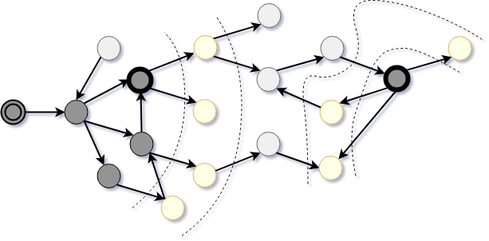

# Abstract

General information about the module GraphBasic.

Collection of abstract data structures and algorithms to process graphs. The module does not bound to any specific format of a graph, so providing adapters toy may use it with anyone. It implements depth-first search, breadth-first search, extracting strongly connected components, topological sort, shortest path search, and others.

### Advantages

Among advantages of this implementation of graph algorithms over other:

- Practice-driven
  Not purely theoretical.
- It's abstract
  Not bound to a specific data structure or data type.

### Features to implement

- Find a center.
- Find a size of a diameter.
- Find a random diameter.
- Find number of diameters.
- Find a centroid.
- Is event, does euler trail exist?

[Back to content](../README.md#Tutorials)
