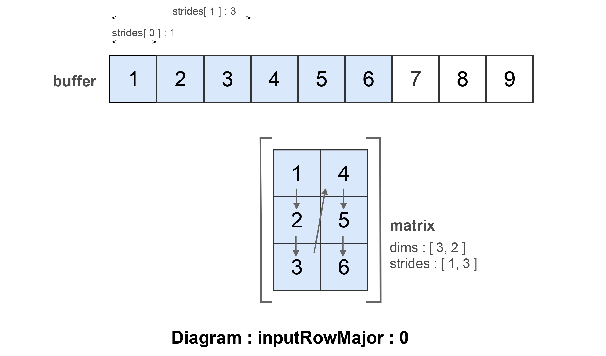
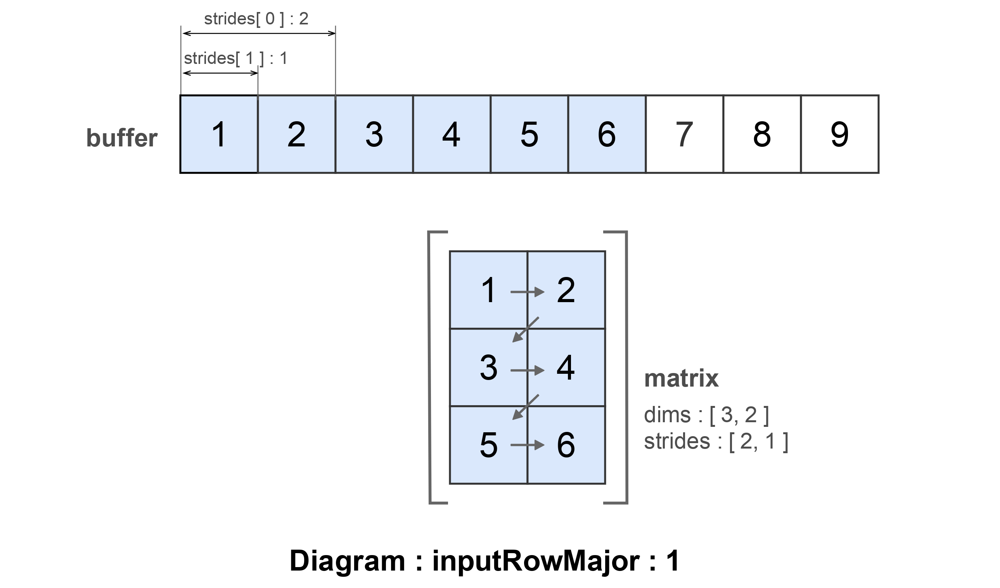

# How to use option strides

How to use the option <code>strides</code> to interpret a buffer as a matrix.

### Standard strides

An object of the class `Matrix` could be created by an explicit call of the constructor.

```js
var matrix = new _.Matrix
({
  buffer : [ 1, 2, 3, 4, 5, 6, 7, 8, 9 ],
  dims : [ 3, 2 ],
  inputRowMajor : 0,
});
console.log( `matrix :\n${ matrix }` );
/* log : matrix :
Matrix.Array.3x2 ::
  +1 +4
  +2 +5
  +3 +6
*/
console.log( `effective strides :\n${ matrix.stridesEffective }` );
/* log : effective strides :
[ 1, 3 ]
*/
```

Three options are the minimum amount of information required to call the matrix constructor. Data buffer `buffer`, information about dimensions `dims`, and the option `inputRowMajor` - hints on whether the input data will be transposed.

By default, the elements in the buffer are in such sequence:



Option `inputRowMajor : 1` alter algorithm of strides calculation.

```js
var matrix = new _.Matrix
({
  buffer : [ 1, 2, 3, 4, 5, 6, 7, 8, 9 ],
  dims : [ 3, 2 ],
  inputRowMajor : 1,
});
console.log( `matrix :\n${ matrix }` );
/* log : matrix :
Matrix.Array.3x2 ::
  +1 +2
  +3 +4
  +5 +6
*/
console.log( `effective strides :\n${ matrix.stridesEffective }` );
/* log : effective strides :
[ 2, 1 ]
*/
```

With `inputRowMajor : 1` strides are `[ 2, 1 ]`, instead of `[ 1, 2 ]` of the previous example. Sequence looks like that:



The option `inputRowMajor` shows the constructor to calculate strides. Alternatively, it is possible to specify strides explicitly:

```js
var matrix = new _.Matrix
({
  buffer : [ 1, 2, 3, 4, 5, 6, 7, 8, 9 ],
  dims : [ 3, 2 ],
  strides : [ 2, 1 ],
});
console.log( `matrix :\n${ matrix }` );
/* log : matrix :
Matrix.Array.3x2 ::
  +1 +2
  +3 +4
  +5 +6
*/
console.log( `effective strides :\n${ matrix.stridesEffective }` );
/* log : effective strides :
[ 2, 1 ]
*/
```

Unlike the previous example, strides in this example are specified explicitly, but the result is the same.


The diagram shows how the buffer maps into the matrix. All scalars follow one by one. By default, `strides` are calculated so that all scalars go one after another. The option `inputRowMajor` specifies in which sequence row and column go.

Alternatively, one of the [static routines](./MatrixCreation.md) `_.Matrix.Make*` may be used to create a matrix.

### Non-standard strides

The value of strides could be specified during construction.

```js
var matrix = new _.Matrix
({
  buffer : [ 1, 2, 3, 4, 5, 6, 7, 8, 9 ],
  dims : [ 3, 2 ],
  strides : [ 3, 1 ],
  offset : 1,
});
console.log( `matrix :\n${ matrix }` );
/* log : matrix :
Matrix.Array.3x2 ::
  +2 +3
  +5 +6
  +8 +9
*/
```

The value of the first element in the option `strides` determines what offset to make to get the next scalar of the given column. The value of the second element in the option `strides` determines what offset to make to get the next scalar of the given string.


The diagram shows how scalars of the matrix are put in the buffer `buffer`. Buffer offset is `1`. `strides` has the value `[ 3, 1 ]`.

### Negative strides

```js
var matrix = new _.Matrix
({
  buffer : [ 1, 2, 3, 4, 5, 6, 7, 8, 9 ],
  dims : [ 3, 2 ],
  offset : 8,
  strides : [ -2, -1 ],
});
console.log( `matrix :\n${ matrix }` );
/* log : matrix :
Matrix.Array.3x2 ::
  +9 +8
  +7 +6
  +5 +4
*/
```

A negative strides `-2, -1` is given to the matrix `matrix`, it leads to the interpretation of the buffer in the matrix in the opposite direction.


The diagram shows how the scalars of the matrix are put in the buffer `buffer`. The offset is `8`. Elements in the buffer are reversed.

### Zero-copy transposing

The matrix can be transposed without copying. It is possible to transpose a matrix by changing only strides. Example demonstrate zero-copy transposing of a matrix.

```js
var buffer1 = new I32x( [ 0, 1, 2, 3, 4, 5, 6, 7, 8, 9, 10, 11 ] );
var matrix = new _.Matrix
({
  buffer : buffer1,
  dims : [ 3, 2 ],
  strides : [ 3, 1 ],
  offset : 1,
});
console.log( `matrix :\n${ matrix }` );
/* log : matrix :
Matrix.I32x.3x2 ::
  +1 +2
  +4 +5
  +7 +8
*/
var matrixTransposed = new _.Matrix
({
  buffer : buffer1,
  dims : [ 2, 3 ],
  strides : [ 1, 3 ],
  offset : 1,
});
console.log( `transposed matrix :\n${ matrixTransposed }` );
/* log : transposed matrix :
Matrix.I32x.2x3 ::
  +1 +4 +7
  +2 +5 +8
*/
```

Both matrices `matrix` and` matrixTransposed` use the same buffer but interpret it differently. The transposing is made by changing of interpretation of the buffer `buffer1`. The matrix `matrixTransposed` uses other strides and dimensions. That's how transposing is achieved without copying data.

That is how the method `matrix.transpose()` works.

```js
var buffer1 = new I32x([ 0, 1, 2, 3, 4, 5, 6, 7, 8, 9, 10, 11 ]);
var matrix = new _.Matrix
({
  buffer : buffer1,
  dims : [ 3, 2 ],
  strides : [ 3, 1 ],
  offset : 1,
});
console.log( `matrix :\n${ matrix }` );
/* log : matrix :
Matrix.I32x.3x2 ::
  +1 +2
  +4 +5
  +7 +8
*/
matrix.transpose();
console.log( `transposed matrix :\n${ matrix }` );
/* log : transposed matrix :
Matrix.I32x.2x3 ::
  +1 +4 +7
  +2 +5 +8
*/
```

The dimensions and strides of the matrix `matrix` are changed by the method `matrix.transpose()` in the same way as in the previous example as the result matrix is transposed.


The diagram above shows how the buffer is interpreted into the matrix. When changing strides and dimensions, the matrix is transposed without changing the data in the buffer `buffer1`.

### Submatrices

```js
var matrix = new _.Matrix
({
  buffer : [ 0, 1, 2, 3, 4, 5, 6, 7, 8, 9, 10, 11, 12, 13, 14, 15 ],
  dims : [ 4, 3 ],
  offset : 1,
  strides : [ 4, 1 ],
});
console.log( `matrix :\n${ matrix }` );
/* log : matrix :
Matrix.Array.4x3 ::                                                                                                                                                    [10/
  +1 +2 +3
  +5 +6 +7
  +9 +10 +11
  +13 +14 +15
*/
var sub1 = matrix.submatrix( [ 1, 2 ], [ 0, 1 ] );
console.log( `submatrix1 :\n${ sub1 }` );
/* log : submatrix1 :
Matrix.Array.2x2 ::
  +5 +6
  +9 +10
*/
var sub2 = matrix.submatrix( [ 1, 2 ], [ 1, 2 ] );
console.log( `submatrix2 :\n${ sub2 }` );
/* log : submatrix2 :
Matrix.Array.2x2 ::
  +6 +7
  +10 +11
*/
sub1.mul( [ sub1, 2 ] );
sub2.mul( [ sub2, 10 ] );
console.log( `matrix :\n${ matrix }` );
/* log : matrix :
Matrix.Array.4x3 ::
  +1 +2 +3
  +10 +120 +70
  +18 +200 +110
  +13 +14 +15
*/
```


The diagram above shows how two submatrices `sub1` and` sub2` of the same matrix `matrix` can be used independently of each other. Matrices do not own data buffer but refer to it. The dotted lines show how the matrices are put in the buffer and the corresponding matrix. All matrices use the same buffer, so common scalars of submatrices have increased `20` times.

[Back to content](../README.md#Tutorials)
