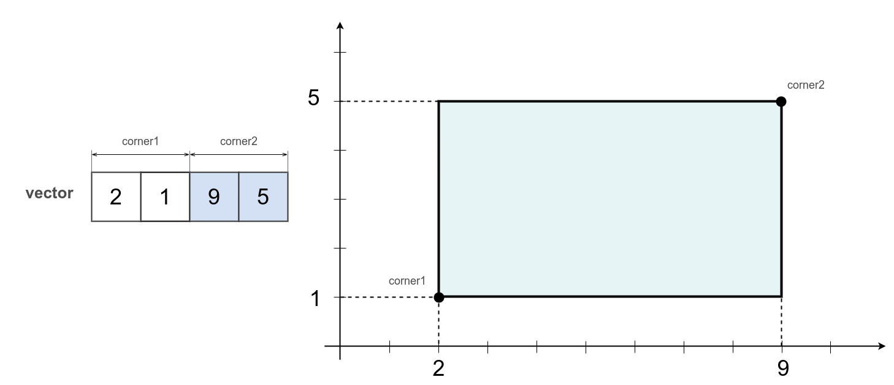

# module::MathModels  [](https://github.com/Wandalen/wMathModels/actions/workflows/StandardPublish.yml) [](https://github.com/emersion/stability-badges#experimental)

Collection of functions to operate such geometrical models as Sphere, Box, Plane, Frustum, Ray, Axis and Angle, Euler's Angles, Quaternion and other. Why MathModels? Three reasons. All functions of the module are purely functional. MathModels heavily relies on another great concept MathVector what makes the module less sensible to data formats of operational objects. The module provides functions for conversions from one to another conceptual form, for example from Quaternion to Euler's Angles or from Euler's Angles to Quaternion or between different representations of Euler's Angles. Unlike MathModels, many alternatives do conversions inconsistently or inaccurately. MathModels is densely covered by tests and optimized for accuracy. Use MathModels to have uniform experience solving geometrical problems and to get a more flexible program.

### Try out from the repository

```
git clone https://github.com/Wandalen/wMathModels
cd wMathModels
will .npm.install
node sample/trivial/Sample.s
```

Make sure you have utility `willbe` installed. To install willbe: `npm i -g willbe@stable`. Willbe is required to build of the module.

### To add to your project

```
npm add 'wmathmodels@stable'
```

`Willbe` is not required to use the module in your project as submodule.

### Making an instance

Every model has a defined of routines `make` and `from` for creating an instance of it. Calling without arguments creates an instance with default parameters. Also, each model defines routine `is` which answers the question: "is this essence an instance of this model".

### Routine make

The routine `make` allows to create an instance of a model. A new instance can be created based on a given dimensionality or another instance. If an instance of a model is used as an argument, the new instance will be a copy of the original instance.

Creation of an instance of the model `box` with dimensions by default:

```js
var box = _.box.make();
console.log( `Type : ${ _.entity.strType( box ) }` );
/* log : Type : Array */
console.log( box );
/* log : [ 0, 0, 0, 0, 0, 0 ] */
console.log( `_.box.is( box ) : ${ _.box.is( box ) }` );
/* log : _.box.is( box ) : true */
```

Box `box` is in `3D` space. The first three scalars describe one extreme point, while the last three scalars describe another extreme point. Those are the model's default parameters.

Every model implements routine `make` and defines default arguments so that an instance can be created through a call without arguments.

The invocation of the routine `make` with a scalar creates a box with a given dimensionality.

```js
var dim = 2;
var box = _.box.make( dim );
console.log( box );
/* log : [ 0, 0, 0, 0 ] */
console.log( `Type : ${ _.entity.strType( box ) }` );
/* log : Type : Array */
console.log( `_.box.is( box ) : ${ _.box.is( box ) }` );
/* log : _.box.is( box ) : true */
```

Box `box` is created in 2D space, unlike the previous example, the vector has only 4 scalars - 2 for each vertex.

To create with a sample pass the sample as the argument to the routine `make`.

```js
var srcBox = [ 2, 1, 9, 5 ];
var box = _.box.make( srcBox );
console.log( box );
/* log : [ 2, 1, 9, 5 ] */
console.log( `srcBox === box : ${ srcBox === box }` );
/* log : srcBox === box : false */
console.log( `Type : ${ _.entity.strType( box ) }` );
/* log : Type : Array */
console.log( `_.box.is( box ) : ${ _.box.is( box ) }` );
/* log : _.box.is( box ) : true */
```

Dimensionality and all the data of the `box` are the same as in `srcBox`.



Call `_.box.make( srcBox )` creates and returns a vector which contains 4 scalars, 2 for each point. Two points describe a box.

Creation with default parameters:

```js
var box = _.box.make( null );
console.log( box );
/* log : [ 0, 0, 0, 0 ] */
console.log( `Type : ${ _.entity.strType( box ) }` );
/* log : Type : Array */
console.log( `_.box.is( box ) : ${ _.box.is( box ) }` );
/* log : _.box.is( box ) : true */
```

The semantics is the same as in the example with a call without arguments. The pragmatics is different: an imaginary instance with default parameters is used as a sample.

### Routine from

An alternative way to create an instance of a mathematical model is using the routine `from`. The routine `from` the same as `make` constructs a new instance, but unlike the routine `make`, performs an additional checking. The routine `from` creates a new instance only if an argument of the call is not an instance of that model. If an argument of the call `from` is an instance of that model, it is returned without any changes.

Let's create an instance of the box model manually and pass it as the routine input.

```js
var srcBox = new F32x([ 2, 1, 9, 5 ]);
var box = _.box.from( srcBox );
console.log( box );
/* log : Float32Array(4) [ 2, 1, 9, 5 ] */
console.log( `srcBox === box : ${ srcBox === box }` );
/* log : srcBox === box : true */
console.log( `Type : ${ _.entity.strType( box ) }` );
/* log : Type : F32x */
console.log( `_.box.is( box ) : ${ _.box.is( box ) }` );
/* log : _.box.is( box ) : true */
```

The routine `_.box.from()` first of all, checks whether `srcBox` is an instance of the model `box`. And `srcBox` is an instance of the model `box` so it is returned without any changes from the routine `_.box.from()`.

Alternatively the routine `from()` accepts a vector adapter.

```js
var srcBox = _.vad.fromLong([ 2, 1, 9, 5 ]);
var box = _.box.from( srcBox );
console.log( box );
/* log : VectorAdapter.x4.Array :: 2.000 1.000 9.000 5.000 */
console.log( `srcBox === box : ${ srcBox === box }` );
/* log : srcBox === box : true */
console.log( `_.box.is( box ) : ${ _.box.is( box ) }` );
/* log : _.box.is( box ) : true */
```

The same as in the previous example the routine `_.box.from()` returns `srcBox` without any changes.

If `from` takes `null` as an argument, we'll get the same semantics as in the routine `make`.

```js
var box = _.box.from( null );
console.log( box );
/* log : [ 0, 0, 0, 0, 0, 0 ] */
console.log( `Type : ${ _.entity.strType( box ) }` );
/* log : Type : Array */
console.log( `_.box.is( box ) : ${ _.box.is( box ) }` );
/* log : _.box.is( box ) : true */
```

The routine `_.box.from()` creates a new instance of the box model with default parameters.

### Make vs from

Two alternative ways `make()` and `from()` for the creation of instances of mathematical models have similarities and differences.

```js
var box1 = _.box.make( null );
console.log( `Box1 : ${ box1 }` );
/* log : Box1 : [ 0, 0, 0, 0, 0, 0 ] */

var box2 = _.box.from( null );
console.log( `Box2 : ${ box2 }` );
/* log : Box2 : [ 0, 0, 0, 0, 0, 0 ] */

```

Both calls create a new instance of the model `box` with the dimensionality defined by default. Semantics and pragmatics are the same.

The difference between routines `make()` and `from()` is what they do with prepared instances as arguments.

```js
var src1 = [ 2, 1, 9, 5 ];
var box1 = _.box.make( src1 );
console.log( 'Box1 :', box1 );
/* log : Box1 : [ 2, 1, 9, 5 ] */
console.log( 'src1 === box1 :', src1 === box1 );
/* log : src1 === box1 : false */

var src2 = [ 2, 1, 9, 5 ];
var box2 = _.box.from( src2 );
console.log( 'Box2 :', box2 );
/* log : Box2 : [ 2, 1, 9, 5 ] */
console.log( 'src2 === box2 :', src2 === box2 );
/* log : src2 === box2 : true */
```

Both calls `make()` and `from()` return an instance of the model box with parameters `[ 2, 1, 9, 5 ]`. But the routine `make()` created a copy of `src1`, and the routine `from()` returned `src1` without any changes.

### Uncoupling data and functionality

Data of instances of all mathematical models are stored in the **vector** ( of any form ) or **matrix**. The container for the model box, quaternion, straight line, and many others is a **vector**.

A vector might have the following forms:

- array ( Array )
- typed array ( BufferTyped )
- vector adapter ( VectorAdapter )

A vector adapter is a kind of link that defines how to interpret data as the vector.

The container for the model polygon and frustum is a **matrix**. A matrix is capable of transferring multidimensional information, what is required for models like a polygon.

A **zero-copy principle** can be implemented both through the matrix and through the vector adapter.

Uncoupling of the data and functionality:

 - makes it possible to avoid useless copying of data.
 - simplifies the use of the module.
 - standardizes the interface.
 - algorithms of all models are not tied to the form, the format, or the type of the data.
 - makes the system more extendable

Algorithms and data are uncoupled. Algorithms are implemented on the abstract interface of the vector adapter or matrix.

```js
var srcBox = new F32x([ 2, 1, 9, 5 ]);
var box = _.box.from( srcBox );
console.log( box );
/* log : Float32Array(4) [ 2, 1, 9, 5 ] */
console.log( `Type : ${ _.entity.strType( box ) }` );
/* log : Type : F32x */
console.log( `srcBox === box : ${ srcBox === box }` );
/* log : srcBox === box : true */
```

Please note that `box` is an ordinary vector and not some kind of object. This is a direct manifestation of the **uncoupling of the data and functionality principle**.

### Namespaces logistics

All model's algorithms are called through namespace models, for example for the box it is `_.box.*`, for quaternion, it is `_.quat.*`, while an instance of the model is a **vector** or a **matrix**, and not an instance of some other additional class. All mathematical model's algorithms are called functionally, for example:

```js
var distance = _.plane.pointDistance( plane, point );
```

Here a `plane` is a vector, which is interpreted as an implicit plane equation, `point` is a vector, which is interpreted as a point and `distance` is a returned scalar. There is no implicit side effect.

### Components of models

All mathematical models in this module ( a vector as well as a matrix ) consist of atomic parts, on the lowest level those are scalars, which are often grouped into larger groups.

```js
var box = new F32x([ 2, 1, 9, 5 ]);
var cornerLeft = _.box.cornerLeftGet( box );
var cornerRight = _.box.cornerRightGet( box );
console.log( `cornerLeft : ${ cornerLeft }` );
/* log : cornerLeft : VectorAdapter.x2.F32x :: 2.000 1.000 */
console.log( `cornerRight : ${ cornerRight }` );
/* log : cornerRight : VectorAdapter.x2.F32x :: 9.000 5.000 */
```

An instance of the model `box` is created manually. Routine `_.box.cornerLeftGet( box )` creates a vector adapter for the left bottom point of the box and then output it to the log.

Routines for access to the components of the instances of the models return not a copy of the data but a vector adapter. A vector adapter is a kind of link to the data and it doesn't have this data.

```js
var box = new F32x([ 2, 1, 9, 5 ]);
var cornerLeft = _.box.cornerLeftGet( box );
console.log( `cornerLeft : ${ cornerLeft }` );
/* log : cornerLeft : VectorAdapter.x2.F32x :: 2.000 1.000 */
cornerLeft.assign([ 3, 4 ]);
console.log( `box : ${ box }` );
/* log : box : 3,4,9,5 */
```

A vector adapter `cornerLeft` is used to change the value of the first vertex of the box.

Routines to access to the components of the models accept vectors in any form, including vector adapters.

```js
var box = _.vad.from([ 2, 1, 9, 5 ]);
var cornerLeft = _.box.cornerLeftGet( box );
var cornerRight = _.box.cornerRightGet( box );
console.log( `cornerLeft : ${ cornerLeft }` );
/* log : cornerLeft : VectorAdapter.x2.Array :: 2.000 1.000 */
console.log( `cornerRight : ${ cornerRight }` );
/* log : cornerRight : VectorAdapter.x2.Array :: 9.000 5.000 */
```

The output is similar to the first example.

### Isomorphic

The behavior is unchanged even if model changes.

For example, an algorithm for checking that the point is on the boundary or inside is implemented by the routine `pointContains`. All models for which it's possible to implement such an algorithm have this routine with this name.

```js
var point = [ 0, 1, 2 ];
var plane = [ 0, 1, 2, -1 ];
var contains = _.plane.pointContains( plane, point );
console.log( `Plane contains point : ${ contains }` );
/* log : Plane contains point : true */
```

`true` is returned to the variable `contains`, because the point `point` is on the plane `plane`.

```js
var point = [ 0, 1 ];
var line = [ 0, 0, 0, 2 ];
var contains = _.linePointDir.pointContains( line, point );
console.log( `Line contains point : ${ contains }` );
/* log : Line contains point : true */
```

`true` is returned to the variable `contains`, because the point `point` is on the line `line`.

```js
var point = [ 0, 1 ];
var vertices =
[
  1, 0, 0,
  0, 0, 1
];
var polygon = _.convexPolygon.make( vertices, 2 );
var contains = _.convexPolygon.pointContains( polygon, point );
console.log( `Polygon contains point : ${ contains }` );
/* log : Polygon contains point : true */
```

A convex polygon `polygon` is created in 2D based on the coordinates of the vertices from the vector `vertices`. `true` is returned to the variable `contains`, because the point `point` is on the boundary of the polygon `polygon`.

### Intuitive

The routines have intuitive names. Knowledge of one routine helps to guess about other routines. The search in the module and its research can be made by combining prefixes/suffixes.

An example of using a group of routines `*Intersects` to check the cross-section of the model instance `plane` with instances of other models.

```js
var plane = [ -2, 0, 2, 0 ];
var box = [ 0, 0, 0, 2, 2, 2 ];
var intersected = _.plane.boxIntersects( plane, box );
console.log( `Plane intersects with box : ${ intersected }` );
/* log : Plane intersects with box : true */
```

`true` is returned to the variable `intersected`, because the plane `plane` crosses the box `box`.

```js
var plane = [ 1, 1, 0, 0 ];
var capsule = [ - 1, 2, 3, -1, 2, 3, 0  ];
var intersected = _.plane.capsuleIntersects( plane, capsule );
console.log( `Plane intersects with capsule : ${ intersected }` );
/* log : Plane intersects with capsule: true */
```

`true` is returned to the variable `intersected`, because the plane `plane` crosses the capsule `capsule`.

```js
var plane = [ -0.4, 1, 0, 0 ];
var frustum = _.frustum.make().copy
([
  -1,   0,  -1,   0,   0,  -1,
   0,   0,   0,   0,  -1,   1,
   1,  -1,   0,   0,   0,   0,
   0,   0,   1,  -1,   0,   0,
]);
var intersected = _.plane.frustumIntersects( plane, frustum );
console.log( `Plane intersects with frustum : ${ intersected }` );
/* log : Plane intersects with frustum : true */
```

An instance `frustum` of the model frustum is created by defining spaces of 6 faces. From the output, it is clear that the container for the data for the instance of the model is a matrix. `true` is returned to the variable `intersected`, because the plane `plane` crosses the truncated pyramid `frustum`.

```js
var plane = [ 1, 1, 0, 0 ];
var intersected = _.plane.planeIntersects( plane, plane );
console.log( `Plane intersects with plane : ${ intersected }` );
/* log : Plane intersects with plane : true */
```

`true` is returned to the variable `intersected`, because the plane `plane` crosses itself.

```js
var plane = [ 1, 1, 0, 0 ];
var line = [ 1, 0, 1, 1, 1, 1 ];
var intersected = _.plane.lineIntersects( plane, line );
console.log( `Plane intersects with line : ${ intersected }` );
/* log : Plane intersects with line : true */
```

`true` is returned to the variable `intersected`, because the plane `plane` is crossed by the line `line`.

```js
var plane = [ 1, 1, 0, 0 ];
var segment = [ -2, -2, -2, 2, 2, 2 ];
var intersected = _.plane.segmentIntersects( plane, segment );
console.log( `Plane intersects with segment : ${ intersected }` );
/* log : Plane intersects with segment : true */
```

`true` is returned to the variable `intersected`, because the plane `plane` is crossing with a segment `segment`.

```js
var plane = [ 2, 0, 2, 0 ];
var sphere = [ 0, 0, 0, 1.5 ];
var intersected = _.plane.sphereIntersects( plane, sphere );
console.log( `Plane intersects with sphere : ${ intersected }` );
/* log : Plane intersects with sphere : true */

```

`true` is returned to the variable `intersected`, because the plane `plane` is crossing with a sphere `sphere`.

```js
var plane = [ 1, - 1, 0, 0 ];
var ray = [ 0, 0, 0, 1, 1, 1 ];
var intersected = _.plane.rayIntersects( plane, ray );
console.log( `Plane intersects with ray : ${ intersected }` );
/* log : Plane intersects with ray: true */
```

`true` is returned to the variable `intersected`, because the plane `plane` is crossing with a ray `ray`.

### Convention dst=null

The routines which expect `dst` container as a first argument, can create a new instance of a model instead of rewriting the existing one. `dst` is the argument in which the writing is made if any writing is performed. `dst` is the first argument. `null` as the first argument instructs to create a new container to write the result.

```js
var point1 = [ 3, 1 ];
var point2 = [ 0, 8 ];
var box = _.box.fromPoints( null, [ point1, point2 ] );
console.log( `Box : ${ box }` );
/* log : Box : [ 0, 1, 3, 8 ] */
```

An instance `box` of the model `box` is created from the points `point1` and `point2`. From the output, it's clear that `box` contains `point1` and `point2`.

Alternatively, a container to write the result can be created manually and passed as the first argument.

```js
var point1 = [ 3, 1 ];
var point2 = [ 0, 8 ];
var dstBox = _.box.makeSingular( 2 );
console.log( `Box : ${dstBox}` );
/* log : Box : Infinity,Infinity,-Infinity,-Infinity */
_.box.fromPoints( dstBox, [ point1, point2 ] );
console.log( `Box : ${dstBox}` );
/* log : Box : 0,1,3,8 */
```

The vector `dstBox`, which will be the container for the data of the instance of the model `box` is created. `_.box.makeSingular` fills `dstBox` with infinities. Based on points `point1` and `point2` the extreme points of the box are calculated. As a result, the left bottom point has value `( 0, 1 )` and right top `( 3, 8 )`.

### Naming pattern

Please note the pattern by which the routines obtain their names.

```js
intersected = _.plane.sphereIntersects( plane, sphere );
intersected = _.plane.boxIntersects( plane, box )
euler = _.euler.fromAxisAndAngle( axisAndAngle );
```

The name of the namespace + the name of the routine repeat the sequence of expected arguments. And vice versa it can be guessed from the namespace + the name of the routine what arguments it expects.

### Higher dimension

The same interface hides the implementation of algorithms for different dimensions: 2D, 3D, 4D...

```js
var sphere2d = [ 1, 1, 5 ];
var point2d = [ 2, 2 ];
var contains = _.sphere.pointContains( sphere2d, point2d );
console.log( `Sphere contains point : ${ contains }` );
/* log : Sphere contains point : true */
```

In the 2D case, a sphere is a circle. In all dimensionalities, this model is described by the center and the radius. In 2D case, 3 scalars are enough for description.

```js
var sphere3d = [ 2, 2, 2, 5 ];
var point3d = [ 3, 3, 3 ];
var contains = _.sphere.pointContains( sphere3d, point3d );
console.log( `Sphere contains point : ${ contains }` );
/* log : Sphere contains point : true */
```

In the 3D case, a sphere is described by 4 scalars.

```js
var sphere4d = [ 3, 3, 3, 3, 5 ];
var point4d = [ 4, 4, 4, 4 ];
var contains = _.sphere.pointContains( sphere4d, point4d );
console.log( `Sphere contains point : ${ contains }` );
/* log : Sphere contains point : true */
```

3-sphere or glome is a sphere in 4D space. To describe a glome 5 scalars is enough.

Another good example is determining the distance between a point and a line.

```js
var point = [ 3, 2 ];
var line = [ -4, 4, 0 ];
var distance = _.plane.pointDistance( line, point );
console.log( `Distance from line to point : ${ _.entity.exportString( distance, { precision : 2 } ) }` );
/* log : Distance from line to point : -0.71*/
```

The distance from the point `point` to the line `line` is returned in a variable `distance` which is `-0.71`. Space is 2D.

```js
var point = [ 4, 1, -3 ];
var plane = [ 1, 2, -1, 3 ];
var distance = _.plane.pointDistance( plane, point );
console.log( `Distance from 3D plane to point : ${ _.entity.exportString( distance, { precision : 2 } ) }` );
/* log : Distance from 3D plane to point : -0.27 */
```

The distance from the point `point` to the plane `plane` is returned in a variable `distance` which is `-0.27`. Space is 3D.

### Alternative models

An instance of a model can be converted from one conceptual form to another, alternative.

Rotations can be set by a quaternion, Euler's angles, axis, and angle, or matrix. The straight line can be set by an implicit equation, two points, point, and a relative direction, etc. For each concept can be found several mathematical models. The module implements some of these alternatives and provides tools for converting an instance of one model into an instance of another model.

Model `linePoints` describes a straight line with two points, and a model `linePointDir` describes a straight line with a point and a relative direction. An example of conversion an instance of the model `linePoints` into an instance of the model `linePointDir` and calculation of the point of intersection of the lines set by this or that model.

```js
var linePoints1 = _.linePoints.from([ 1, 1, 3, 3 ]);
var linePoints2 = _.linePoints.from([ 2, 2, 3, 3 ]);
var point1 = _.linePoints.pairIntersectionPoint( linePoints1, linePoints2 );
console.log( `Intersection point : ${ point1 }` );
/* log : Intersection point : [ 2, 2 ] */

var linePointsDir1 = _.linePointDir.fromPoints2( linePoints1 );
var linePointsDir2 = _.linePointDir.fromPoints2( linePoints2 );
var point2 = _.linePointDir.lineIntersectionPoint( linePointsDir1, linePointsDir2 );
console.log( `Intersection point : ${ point2 }` );
/* log : Intersection point: [ 2, 2 ] */

```

Two lines `linePoints1` and `linePoints2` are created based on the coordinates of 2 points. The routine `_.linePoints.pairIntersectionPoint` calculates the coordinates of intersection and writes it into the variable `point1`. Then conversion into model `linePointDir` is performed. `linePointsDir1` and `linePointsDir2` are instances of the model `linePointDir`. `linePointsDir1` and `linePointsDir2` are created based on `linePoints1` and `linePoints2`. Similarly for the model with a point and a relative direction, the routine  `_.linePointDir.pairIntersectionPoint` calculates the coordinates of intersection and writes it into the variable `point2`. The points `point1` and `point2` have the same value `( 2, 2 )` even though they have been calculated with different mathematical models.

More about the model `linePoints` can be read [here.](../concept/Overview.md#LinePoints).
More about the model `linePointDir` can be read [here.](../concept/Overview.md#LinePointDir).

An example of converting Euler's angles into quaternions and back:

```js
var euler1 =  [ 1, 0, 0.5, 0, 1, 2 ] ;
console.log( `Euler : ${ _.entity.exportString( euler1, { precision : 2 } ) }` );
/* log : Euler : [ 1.0, 0.0, 0.50, 0.0, 1.0, 2.0 ] */

var quat = _.euler.toQuat( euler1, null );
console.log( `Quat from Euler : ${ _.entity.exportString( quat, { precision : 2 } ) }` );
/* log : Quat from Euler : [ 0.46, -0.12, 0.22, 0.85 ] */

var euler2 = _.quat.toEuler( quat, null );
console.log( `Euler from Quat : ${ _.entity.exportString( euler2, { precision : 2 } ) }` );
/* log : Euler from Quat : [ 1.0, 0.0, 0.50, 0.0, 1.0, 2.0 ] */
```

The vector `euler1` which is a container of an instance of the Euler's angles mathematical model is created. Quaternion is written into the variable `quat` which is the result of converting from Euler's angles `euler1`. The value of the Euler's angles is written into the variable `euler2` which is the result of converting the quaternion `quat`. From the output, it's clear that the transformation which is described by Euler's angles at the beginning of the example is preserved.

### Box

The mathematical model of n-orthotope, also called a hyperrectangle or a box.

An instance of the model is stored in vector of any form.

```js
var box = [ 2, 1, 9, 5 ];
var point = [ 6, 8 ];
var got = _.box.pointDistance( box, point );
console.log( `Distance from box to point : ${ _.entity.exportString( got, { precision : 2 } ) }` );
/* log : Distance from box to point : 3.0 */
```


In a 2D, the box looks like a rectangle. The bottom left and top right points of this rectangle are used to describe this model. To describe a box in 2D case, 4 scalars are enough.

### Segment

The mathematical model of the segment.

An instance of the model is stored in vector of any form.

```js
var segment = [ 9, 1, 2, 4 ];
var point = [ 3, 5 ];
var distance = _.segment.pointDistance( segment, point );
console.log( `Distance from segment to point : ${ _.entity.exportString( distance, { precision : 2 } ) }` );
/* log : Distance from segment to point : 1.3 */
```


Defined by two points: the beginning of `( 9, 1 )` and the end of the segment `( 2, 4 )`. 4 scalars are enough to describe a segment in 2D.

### Capsule

The mathematical model of the capsule.

A capsule is a segment that has a thickness. The capsule, as well as the segment, is described by two points denoting the beginning and the end, and also has a thickness and rounding at the ends. An instance of the model is stored in vector of any form.

```js
var capsule = [ 9, 1, 2, 4, 0.5 ];
var point = [ 3, 5 ];
var distance = _.capsule.pointDistance( capsule, point );
console.log( `Distance from capsule to point : ${ _.entity.exportString( distance, { precision : 2 } ) }` );
/* log : Distance from capsule to point : 0.81 */
```


The capsule in the example starts at the point `( 9, 1 )`, ends at the point `( 2, 4 )` and has a radius of `0.5`. 5 scalars are enough to describe a capsule in 2D.

### Sphere

The mathematical model of the hypersphere.

In a 2D it's a circle, in 3D it's a normal sphere, in 4D it's a glome. It is described by the center and radius. An instance of the model is stored in vector of any form.

```js
var sphere = [ 2, 1, 3 ];
var point = [ 5, 6 ];
var distance = _.sphere.pointDistance( sphere, point );
console.log( `Distance from sphere to point : ${ _.entity.exportString( distance, { precision : 2 } ) }` );
/* log : Distance from sphere to point : 2.8 */
```


In a 2D, the sphere turns into a circle.

The center of the circle from the example is at the point `( 2, 1 )` and its radius is `3`. 3 scalars are enough to describe a sphere in 2D.

### Ray

The mathematical model of the ray.

The first point is the beginning of the ray, the second sets the direction. An instance of the model is stored in vector of any form.

```js
var ray = [ 2, 1, 6, 3 ];
var point = [ 2, 3 ];
var distance = _.ray.pointDistance( ray, point );
console.log( `Distance from ray to point : ${ _.entity.exportString( distance, { precision : 2 } ) }` );
/* log : Distance from ray to point : 1.8 */
```


The ray `ray` from the example begins at the point `( 2, 1 )` and goes to infinity through the point `( 6, 3 )`. 4 scalars are enough to describe the ray in 2D.

### LinePoints

The mathematical model of a line from two points.

Describes a line with two points through which it passes. An instance of the model is stored in vector of any form.

```js
var line = [ 2, 1, 4, 2 ];
var point = [ 2, 3 ];
var distance = _.linePoints.pointDistance( line, point );
console.log( `Distance from line to point : ${ _.entity.exportString( distance, { precision : 2 } ) }` );
/* log : Distance from line to point : 1.8 */
```


The first two scalars of the `line` vector are the first point, the other two are the second point. A line is constructed through these two points. 4 scalars are enough to describe a line in 2D.

### LinePointDir

The mathematical model of a line from a point and a relative direction.

The second point is set relative to the first. An instance of the model is stored in vector of any form.

```js
var line = [ 2, 1, 2, 1 ];
var point = [ 2, 3 ];
var distance = _.linePointDir.pointDistance( line, point );
console.log( `Distance from line by point and direction to point : ${ _.entity.exportString( distance, { precision : 2 } ) }` );
/* log : Distance from line by point and direction to point : 1.8 */
```


The first two scalars of the `line` vector are the first point, the other two describe the second point. However, in the case of the `lineDir` model, the coordinates of the second point are given relative to the coordinates of the first. A line is constructed through these two points. 4 scalars are enough to describe a line in 2D.

### LinePointCentered

The mathematical model of a line that passes through the origin and a given point.

An instance of the model is stored in vector of any form.

```js
var line = [ 4, 2 ];
var point = [ 2, 3 ];
var distance = _.linePointCentered.pointDistanceCentered2D( line, point );
console.log( `Distance from centered line to point : ${ _.entity.exportString( distance, { precision : 2 } ) }` );
/* log : Distance from centered line to point : 1.8 */
```


The two scalars of the vector `line` are the point through which the line passes. The second point is always the origin. A line is constructed through these two points. To describe a line passing through the origin in 2D, 2 scalars are enough.

### Plane ( implicit )

The mathematical model of a hyper-plane given by an implicit equation.

This mathematical model will always divide the space in which it exists into two halves. In a 2D it will be a line satisfying the equation `w + a * x + b * y = 0`, in 3D it will be a plane satisfying the equation `w + a * x + b * y + c * z = 0`. An instance of the model is stored in vector of any form.

```js
var line = [ -2, -1, 2 ];
var point = [ 2, 3 ];
var distance = _.plane.pointDistance( line, point );
console.log( `Distance from straight to point : ${ _.entity.exportString( distance, { precision : 2 } ) }` );
/* log : Distance from straight to point : 0.89 */
```


The line `line` satisfies the equation `-2 - 1 * x + 2 * y = 0` passes through the points `( -2, 0 )` and `( 0, +1 )`, i.e intersects the axis `x` in `- 2` and the axis `y` in `+ 1`. To describe a line through an implicit equation, 3 scalars are enough.

```js
var plane = [ 0, -2, -1, 2 ];
var point = [ 2, 3, -3 ];
var distance = _.plane.pointDistance( plane, point );
console.log( `Distance from 3D plane to point : ${ _.entity.exportString( distance, { precision : 2 } ) }` );
/* log : Distance from 3D plane to point : 0.89 */
```


As in the case of a straight line, the plane `plane` satisfies the equation `-2 - 1 * x + 2 * y + 0 * z = 0` passes through the points `( -2, 0, z )` and `( 0 , +1, z )` i.e passes through all points where `x = -2` and `y = 0`, as well as through all points where `x = 0` and `y = 1`. 4 scalars are enough to describe a plane through an implicit equation.

### Triangle

The mathematical model of a triangle.

It is defined by three vertices. An instance of the model is stored in vector of any form.

```js
var triangle = [ 2, 1, 9, 2, 5, 6 ];
var point = [ 3, 6 ]
var distance = _.triangle.pointDistance( triangle, point );
console.log( `Distance from triangle to point : ${ _.entity.exportString( distance, { precision : 2 } ) }` );
/* log : Distance from triangle to point : 1.7 */
console.log( `Type : ${ _.entity.strType( triangle ) }` );
/* log : Type : Array */
```


The vertices of the triangle `triangle` go consecutively by 2 scalars to the vertex. 6 scalars are enough to describe a triangle in 2D.

### ConvexPolygon

The mathematical model of a convex polygon.

A convex polygon is a simple polygon ( not self-intersecting ) in which no line segment between two points on the boundary ever goes outside the polygon. In a convex polygon, all interior angles are less than or equal to 180 degrees. In this model of the polygon, it is set by enumerating its vertices counterclockwise. A matrix is used as a container for the data of the convex polygon model instance.

```js
var vertices =
[
  2,  6,  9,  5,
  1, -1,  2,  6,
]
var polygon = _.convexPolygon.make( vertices, 2 );
var point = [ 3, 6 ];
var distance = _.convexPolygon.pointDistance( polygon, point );
console.log( `Distance from convex polygon to point : ${ _.entity.exportString( distance, { precision : 2 } ) }` );
/* log : Distance from convex polygon to point : 1.7 */
console.log( `Type : ${ _.entity.strType( polygon ) }` );
/* log : Type : wMatrix */
```


Columns of the matrix `polygon` stores vertices of the polygon. The number of rows of the matrix `polygon` is equal to the dimension of the mathematical model` 2`, and the number of columns is equal to the number of vertices of the polygon `4`. The 4 vertices of the polygon are connected in series by eges and a convex polygon is formed. In the general case, the polygon can have any number of vertices in space of any dimension. 8 scalars are enough to describe a convex polygon with 4 vertices in 2D.

### ConcavePolygon

The mathematical model of a concave polygon.

A concave polygon is one which have segments between two vertices at the boundary of the polygon going beyond the polygon. In a concave polygon, the internal angles can be greater than 180 degrees. A concave polygon is a more complex mathematical model than a convex one because a concave plogyon can always be divided into a set of convex polygons. In this model of the polygon, it is given by enumerating its vertices counterclockwise. A matrix is used as a container for the data of the concave polygon model instance.

```js
var vertices =
[
  2,  6,  9,  5,
  1,  3,  2,  6
]
var polygon = _.concavePolygon.make( vertices, 2 );
var point = [ 3, 6 ]
var distance = _.concavePolygon.pointDistance( polygon, point );
console.log( `Distance from concave polygon to point : ${ _.entity.exportString( distance, { precision : 2 } ) }` );
/* log : Distance from concave polygon to point : 1.7 */
console.log( `Type : ${ _.entity.strType( polygon ) }` );
/* log : Type : wMatrix */
```


Columns of the matrix `polygon` stores vertices of the polygon. The number of rows of the matrix `polygon` is equal to the dimension of the mathematical model` 2`, and the number of columns is equal to the number of vertices of the polygon `4`. The 4 vertices of the polygon are connected in series by faces and a polygon is formed. In the general case, the polygon can have any number of vertices in space of any dimension. 8 scalars are enough to describe a convex polygon with 4 vertices in 2D.

### Frustum

The mathematical model of frustum - a truncated pyramid.

The truncated pyramid model is often used in 3D graphics to model the visible part of the space of the perspective camera. The model is set by 6 faces. Each face is set by an implicit plane equation. The instance of the model stores its parameters in a 4x6 matrix. The plane equations are stored in the columns of such a matrix.

```js
var frustum = _.frustum.make();
var matrix = _.Matrix.FormPerspective( 90, [ 20, 70 ], [ 10, 50 ] );
_.frustum.fromMatrixHomogenous( frustum, matrix );
console.log( `Frustum from perspective matrix : \n${ frustum }` );
var point = [ 1, 1, 2 ];
/* log :
Matrix.F32x.4x6 ::
  -1.000 1.000  0.000  0.000  0.000  0.000
  0.000  0.000  0.286  -0.286 0.000  0.000
  -1.000 -1.000 -1.000 -1.000 0.500  -2.500
  0.000  0.000  0.000  0.000  25.000 -25.000
*/
var distance = _.frustum.pointDistance( frustum, point );
console.log( `Distance from frustum to point : ${ _.entity.exportString( distance, { precision : 2 } ) }` );
/* log : Distance from frustum to point : 37 */
console.log( `Type of frustum : ${ _.entity.strType( frustum ) }` );
/* log : Type of frustum : wMatrix */
```


The parameters of implicit equations of 6 faces of the truncated pyramid model are calculated from the matrix of perspective transformation. To describe the model of a truncated pyramid it requires 24 scalars.

### AxisAndAngle

Rotation of the object around the axis and the angle.

One possible way to set the rotation. An instance of the model is stored in vector of any form.

```js
var axisAndAngle = [ Math.PI / 4, 1, 0, 0 ];
var euler = _.euler.fromAxisAndAngle2( null, axisAndAngle );
console.log( `AxisAndAngle to Euler : ${ _.entity.exportString( euler, { precision : 2 } ) }` )
/* log : AxisAndAngle to Euler : [ 0.79, 0.0, -0.0, 0.0, 1.0, 2.0 ] */
```


The angle of rotation `axisAndAngle` is 45 degrees, and the axis `( 1, 0, 0 )`, which coincides with the axis `x`. 4 scalars are enough to describe the model of rotation around the axis and the angle.

### Euler

Rotation of the object by Euler's angles.

One possible way to set the rotation. It is set by three angles of rotation around 3 axes and 3 axes ( around which to rotate ). The first 3 scalars of the vector are the angles of rotation, and the last 3 scalars carry information around which axes to rotate. There are a total of 6 scalars in the vector. In 3D, there are 12 possible combinations of the sequence of axes to rotate around:

- x-y-z
- x-z-y
- y-x-z
- y-z-x
- z-x-y
- z-y-x
- x-y-x
- x-z-x
- y-x-y
- y-z-y
- z-x-z
- z-y-z

Some combinations of values of angles of rotation ( it is the first 3 scalars ) are problematic. [Gimbal lock](https://en.wikipedia.org/wiki/Gimbal_lock) can occur, blocking the ability to rotate in the 3rd dimension.

```js
var euler = [ Math.PI/4, 0, 0, 0, 1, 2 ];
var quat = _.euler.toQuat( euler, null );
console.log( `Quat from Euler : ${ _.entity.exportString( quat, { precision : 2 } ) }` );
/* log : Quat from Euler : [ 0.38, 0.0, 0.0, 0.92 ] */
```


The Euler's angles `euler` rotate the object by `45` degrees around the `x` axis, by `0` degrees around the `y` axis, and by `0` degrees around the `z` axis. Note that the first three scalars of the vector `[ Math.PI/4, 0, 0 ]` are the angles of rotation, and the last 3 `[ 0, 1, 2 ]` are information about which axes you want to make these rotations. `[ 0, 1, 2 ]` means `x-y-z`. 6 scalars are required to describe the Euler rotation model.

### Quat

Rotation of an object using a quaternion.

One possible way to set the rotation. Quaternion is an extension of the concept of complex numbers in 3D space. Set by 4 numbers in which the axis of rotation is coded. The length of a valid quaternion is always 1. Unlike Euler angles, the quaternion does not suffer from the problem of [Gimbal lock](https://en.wikipedia.org/wiki/Gimbal_lock).

```js
var quat = [ 0.38, 0.0, 0.0, 0.92 ];
var euler = _.quat.toEuler( quat, null );
console.log( `Quat from Euler : ${ _.entity.exportString( euler, { precision : 2 } ) }` );
/* log : Euler from Quat : [ 0.78, 0.0, -0.0, 0.0, 1.0, 2.0 ] */
```


Quaternion `quat` rotates the object by `45` degrees around the axis `x`. 4 scalars are enough to describe the quaternion model.
