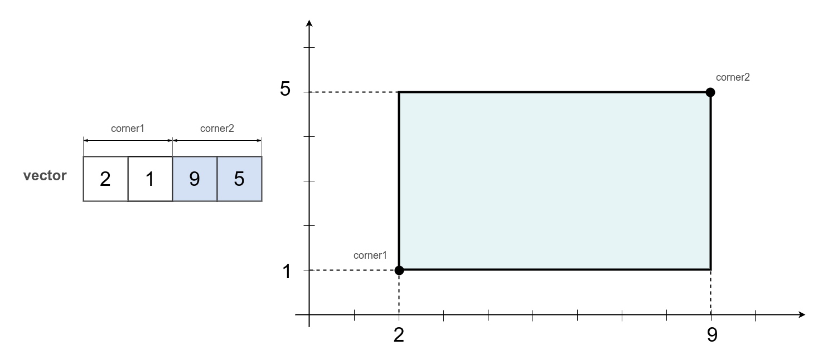

# Введення

Стаття описує основні особливості модуля та принципи його використання.

### Математична модель

Формальний опис системи за допомогою математичних концепцій та мови.

### Making an instance

Кожна модель має визначену пару рутин `make` та `from` для створення її екземпляра. Виклик таких без аргументів створює екземпляр із параметрами за замовчуванням. Також кожна модель визначає рутину `is` котра дає відповідь на питання: "чи дана сутність є екземпляром даної моделі".

### Routine make

Рутина `make` дозволяє створити екземпляр моделі. Новий екземпляр можливо створити на основі заданої розмірності або іншого екземпляра. Якщо як аргумент використано екземпляр моделі, що існує, то новий екземпляр буде копією оригінального екземпляра.

Створення екземпляра моделі `box` із розмірністю за замовчуванням:

```js
var box = _.box.make();
console.log( `Type : ${ _.entity.strType( box ) }` );
/* log : Type : Array */
console.log( box );
/* log : [ 0, 0, 0, 0, 0, 0 ] */
console.log( `_.box.is( box ) : ${ _.box.is( box ) }` );
/* log : _.box.is( box ) : true */
```

Бокс `box` знаходиться у `3D` просторі. Три перших скаляри вектора `box` описують одну крайню точку, тоді як три останніх скаляри описують іншу крайню точку. Це є параметрами моделі бокс за замовчуванням.

Кожна модель реалізує рутину `make` та визначає аргументи за замовчуванням для того, щоб можливо було створити екземпляр викликом без аргументів.

Виклик рутини `make` зі скаляром створить бокс заданої розмірності.

```js
var dim = 2;
var box = _.box.make( dim );
console.log( box );
/* log : [ 0, 0, 0, 0 ] */
console.log( `Type : ${ _.entity.strType( box ) }` );
/* log : Type : Array */
console.log( `_.box.is( box ) : ${ _.box.is( box ) }` );
/* log : _.box.is( box ) : true */
```

Бокс `box` створюється у 2D просторі на відміну від попереднього приклада, вектор має лише 4 скаляри - по 2 на кожну вершину.

Для створення за зразком передайте в рутину `make` зразок.

```js
var srcBox = [ 2, 1, 9, 5 ];
var box = _.box.make( srcBox );
console.log( box );
/* log : [ 2, 1, 9, 5 ] */
console.log( `srcBox === box : ${ srcBox === box }` );
/* log : srcBox === box : false */
console.log( `Type : ${ _.entity.strType( box ) }` );
/* log : Type : Array */
console.log( `_.box.is( box ) : ${ _.box.is( box ) }` );
/* log : _.box.is( box ) : true */
```

Розмірність та всі дані `box` такі ж як в `srcBox`.



Виклик `_.box.make( srcBox )` створює і повертає вектор, котрий містить 4 скаляри, по 2-ва на точку. Дві точки описують бокс.

Створення за зразком за замовчуванням:

```js
var box = _.box.make( null );
console.log( box );
/* log : [ 0, 0, 0, 0 ] */
console.log( `Type : ${ _.entity.strType( box ) }` );
/* log : Type : Array */
console.log( `_.box.is( box ) : ${ _.box.is( box ) }` );
/* log : _.box.is( box ) : true */
```

Семантика така ж як в прикладі із викликом без аргументів. Прагматика дещо інша: як зразок використовується уявний екземпляр із даними за замовчуванням.

### Routine from

Альтернативним способом створити екземпляр математичної моделі є використання рутини `from`. Рутина `from` так само, як і `make` конструює новий екземпляр, але на відміну від рутини `make` ще робить додаткову перевірку. Рутина `from` створює новий екземпляр лише якщо аргументом виклику не є екземпляр даної моделі. Якщо ж на вхід рутини `from` передається екземпляр даної моделі тоді він же повертається без жодних змін.

Створимо екземпляр моделі бокс вручну і передамо її на вхід рутини `from`:

```js
var srcBox = new F32x([ 2, 1, 9, 5 ]);
var box = _.box.from( srcBox );
console.log( box );
/* log : Float32Array(4) [ 2, 1, 9, 5 ] */
console.log( `srcBox === box : ${ srcBox === box }` );
/* log : srcBox === box : true */
console.log( `Type : ${ _.entity.strType( box ) }` );
/* log : Type : F32x */
console.log( `_.box.is( box ) : ${ _.box.is( box ) }` );
/* log : _.box.is( box ) : true */
```

Рутина `_.box.from()` в першу чергу перевіряє чи `srcBox` є екземпляром моделі `box`. І `srcBox` є екземпляром моделі `box` тому не вносячи жодних змін він же і повертається із рутини `_.box.from()`.

Альтернативно рутина `from()` приймає і вектор адаптер.

```js
var srcBox = _.vad.fromLong([ 2, 1, 9, 5 ]);
var box = _.box.from( srcBox );
console.log( box );
/* log : VectorAdapter.x4.Array :: 2.000 1.000 9.000 5.000 */
console.log( `srcBox === box : ${ srcBox === box }` );
/* log : srcBox === box : true */
console.log( `_.box.is( box ) : ${ _.box.is( box ) }` );
/* log : _.box.is( box ) : true */
```

Так само як в попередньому прикладі рутина `_.box.from()` повертає `srcBox` без жодних змін.

Якщо ж у виклик `from` передати `null`, то отримаємо таку ж семантику як у випадку із рутиною `make`.

```js
var box = _.box.from( null );
console.log( box );
/* log : [ 0, 0, 0, 0, 0, 0 ] */
console.log( `Type : ${ _.entity.strType( box ) }` );
/* log : Type : Array */
console.log( `_.box.is( box ) : ${ _.box.is( box ) }` );
/* log : _.box.is( box ) : true */
```

Рутина `_.box.from()` створить новий екземпляр моделі бокс із параметрами за замовчуванням.

### Make vs from

Два альтернативних способи `make()` та `from()` для створення екземплярів математичних моделей мають схожості та відмінності.

```js
var box1 = _.box.make( null );
console.log( `Box1 : ${ box1 }` );
/* log : Box1 : [ 0, 0, 0, 0, 0, 0 ] */

var box2 = _.box.from( null );
console.log( `Box2 : ${ box2 }` );
/* log : Box2 : [ 0, 0, 0, 0, 0, 0 ] */
```

Обидва виклики створюють новий екземпляр моделі `box` із розмірністю визначеною за замовчуванням. Семантика та прагматика однакова.

Відмінність між рутинами `make()` та `from()` в тому, як вони реагують на готові екземпляри як аргументи.

```js
var src1 = [ 2, 1, 9, 5 ];
var box1 = _.box.make( src1 );
console.log( 'Box1 :', box1 );
/* log : Box1 : [ 2, 1, 9, 5 ] */
console.log( 'src1 === box1 :', src1 === box1 );
/* log : src1 === box1 : false */

var src2 = [ 2, 1, 9, 5 ];
var box2 = _.box.from( src2 );
console.log( 'Box2 :', box2 );
/* log : Box2 : [ 2, 1, 9, 5 ] */
console.log( 'src2 === box2 :', src2 === box2 );
/* log : src2 === box2 : true */
```

Обидва виклики `make()` та `from()` повернули екземпляр моделі бокс із параметрами `[ 2, 1, 9, 5 ]`. Але рутина `make()` створила копію `src1`, а рутина `from()` повернула `src1` без жодних змін.

### Uncoupling data and functionality

Дані екземплярів всіх математичних моделей цього модуля зберігаються у **векторі** ( будь-якої форми ) або **матриці**. Контейнером для моделі бокс, кватерніон, пряма та багато інших є **вектор**.

Вектор може мати такі форми:

- масив ( Array )
- типізований масив ( BufferTyped )
- вектор адаптер ( VectorAdapter )

Вектор адаптер є свого роду посиланням, що визначає як саме інтерпретувати дані в вектор.

Контейнером для моделі полігон та фрустум ( frustum ) є **матриця**. Матриця здатна переносити багатовимірну інформацію, що є необхідністю для таких моделей, як полігон.

Як через матрицю так і через вектор адаптер можливо реалізувати **zero-copy принцип**.

Розчіплення даних та функціоналу:

 - дає можливість уникнути марного копіювання даних
 - спрощує використання модуля
 - стандартизує інтерфейс
 - алгоритми всіх моделей не прив'язані до форми, формату чи типа даних.
 - робить систему більш розширюваною.

Алгоритми та дані розчіплені <!-- uncoupled -->. Алгоритми реалізовані на абстрактному інтерфейсі вектор адаптера або матриці.

```js
var srcBox = new F32x([ 2, 1, 9, 5 ]);
var box = _.box.from( srcBox );
console.log( box );
/* log : Float32Array(4) [ 2, 1, 9, 5 ] */
console.log( `Type : ${ _.entity.strType( box ) }` );
/* log : Type : F32x */
console.log( `srcBox === box : ${ srcBox === box }` );
/* log : srcBox === box : true */
```

Зверніть увагу, що `box` є звичайним вектором, а не якимось об'єктом. Це і є прямим проявом **принципу розчіплення даних та функціоналу**.

### Namespaces logistics

Всі алгоритми моделей викликаються через неймспейс моделі, наприклад для боксу це є `_.box.*`, для кватерніона `_.quat.*` тоді, як екземпляр моделі є **вектором** або **матрицею**, а не об'єктом якогось додаткового класу. Всі алгоритми математичної моделі викликаються функціонально, наприклад:

```js
var distance = _.plane.pointDistance( plane, point );
```

Тут `plane` є вектором, що інтерпретується, як неявне рівняння площини, `point` є вектором, що інтерпретується, як точка і повертається скаляр `distance`. Нема жодного неявного побічного ефекту.

### Components of models

Всі математичні моделі в цьому модулі ( як векторні, так і матричні ) складаються з атомарних частин, на найнижчому рівні це скаляри, які часто групуються в більші групи.

```js
var box = new F32x([ 2, 1, 9, 5 ]);
var cornerLeft = _.box.cornerLeftGet( box );
var cornerRight = _.box.cornerRightGet( box );
console.log( `cornerLeft : ${ cornerLeft }` );
/* log : cornerLeft : VectorAdapter.x2.F32x :: 2.000 1.000 */
console.log( `cornerRight : ${ cornerRight }` );
/* log : cornerRight : VectorAdapter.x2.F32x :: 9.000 5.000 */
```

Вручну створюється екземпляр моделі бокс `box`. Рутиною `_.box.cornerLeftGet( box )` створюється вектор адаптер на ліву нижню точку боксу і далі вивід її в лог.

Рутини для доступу до компонентів екземплярів моделей повертають не копію даних, а вектор адаптер. Вектор адаптер є свого роду посиланням на дані, і не володіє цими даними.

```js
var box = new F32x([ 2, 1, 9, 5 ]);
var cornerLeft = _.box.cornerLeftGet( box );
console.log( `cornerLeft : ${ cornerLeft }` );
/* log : cornerLeft : VectorAdapter.x2.F32x :: 2.000 1.000 */
cornerLeft.assign([ 3, 4 ]);
console.log( `box : ${ box }` );
/* log : box : 3,4,9,5 */
```

Вектор адаптер `cornerLeft` використано для того щоб змінити значення першої вершини боксу.

Рутини для доступу для компонентів моделі приймають вектори в будь-якій формі, в тому числі вектор адаптери.

```js
var box = _.vad.from([ 2, 1, 9, 5 ]);
var cornerLeft = _.box.cornerLeftGet( box );
var cornerRight = _.box.cornerRightGet( box );
console.log( `cornerLeft : ${ cornerLeft }` );
/* log : cornerLeft : VectorAdapter.x2.Array :: 2.000 1.000 */
console.log( `cornerRight : ${ cornerRight }` );
/* log : cornerRight : VectorAdapter.x2.Array :: 9.000 5.000 */
```

Вивід аналогічний тому, що мав перший приклад.

### Isomorphic

Поведінка рутин залишається незмінною при зміні моделі.

Наприклад, алгоритм перевірки того, що точка знаходиться на межі або всередині реалізований рутиною `pointContains`. Всі моделі для яких можливо реалізувати такий алгоритм мають таку рутину і вона називається саме так.

```js
var point = [ 0, 1, 2 ];
var plane = [ 0, 1, 2, -1 ];
var contains = _.plane.pointContains( plane, point );
console.log( `Plane contains point : ${ contains }` );
/* log : Plane contains point : true */
```

В змінну `contains` повертається `true`, оскільки точка `point` знаходиться на площині `plane`.

```js
var point = [ 0, 1 ];
var line = [ 0, 0, 0, 2 ];
var contains = _.linePointDir.pointContains( line, point );
console.log( `Line contains point : ${ contains }` );
/* log : Line contains point : true */
```

В змінну `contains` повертається `true`, оскільки точка `point` знаходиться на лінії `line`.

```js
var point = [ 0, 1 ];
var vertices =
[
  1, 0, 0,
  0, 0, 1
];
var polygon = _.convexPolygon.make( vertices, 2 );
var contains = _.convexPolygon.pointContains( polygon, point );
console.log( `Polygon contains point : ${ contains }` );
/* log : Polygon contains point : true */
```

Створюється опуклий полігон `polygon` у 2D на основі координат вершин із вектора `vertices`. В змінну `contains` повертається `true`, оскільки точка `point` лежить на межі полігона `polygon`.

### Intuitive

Рутини маю інтуїтивні назви. Знання про одну рутину допомагає здогадатися про інші рутини. Пошук в модулі та його дослідження можливо здійснювати комбінуванням префіксів/суфіксів.

Приклад використання групи рутин `*Intersects` для перевірки перетину екземпляра моделі `plane` з екземплярами інших моделей.

```js
var plane = [ -2, 0, 2, 0 ];
var box = [ 0, 0, 0, 2, 2, 2 ];
var intersected = _.plane.boxIntersects( plane, box );
console.log( `Plane intersects with box : ${ intersected }` );
/* log : Plane intersects with box : true */
```

В змінну `intersected` повертається `true`, оскільки площина `plane` перетинає бокс `box`.

```js
var plane = [ 1, 1, 0, 0 ];
var capsule = [ - 1, 2, 3, -1, 2, 3, 0  ];
var intersected = _.plane.capsuleIntersects( plane, capsule );
console.log( `Plane intersects with capsule : ${ intersected }` );
/* log : Plane intersects with capsule: true */
```

В змінну `intersected` повертається `true`, оскільки площина `plane` перетинає капсулу `capsule`.

```js
var plane = [ -0.4, 1, 0, 0 ];
var frustum = _.frustum.make().copy
([
  -1,   0,  -1,   0,   0,  -1,
   0,   0,   0,   0,  -1,   1,
   1,  -1,   0,   0,   0,   0,
   0,   0,   1,  -1,   0,   0,
]);
var intersected = _.plane.frustumIntersects( plane, frustum );
console.log( `Plane intersects with frustum : ${ intersected }` );
/* log : Plane intersects with frustum : true */
```

Створюється екземпляр `frustum` моделі frustum задаючи площини 6-ти граней. Із виводу зрозуміло, що контейнером для даних екземпляра моделі є матриця. В змінну `intersected` повертається `true`, оскільки як площина `plane` перетинає зрізану піраміду `frustum`.

```js
var plane = [ 1, 1, 0, 0 ];
var intersected = _.plane.planeIntersects( plane, plane );
console.log( `Plane intersects with plane : ${ intersected }` );
/* log : Plane intersects with plane : true */
```

В змінну `intersected` повертається `true`, оскільки як площина `plane` перетинає сама себе.

```js
var plane = [ 1, 1, 0, 0 ];
var line = [ 1, 0, 1, 1, 1, 1 ];
var intersected = _.plane.lineIntersects( plane, line );
console.log( `Plane intersects with line : ${ intersected }` );
/* log : Plane intersects with line : true */
```

В змінну `intersected` повертається `true`, оскільки площина `plane` перетинається лінією `line`.

```js
var plane = [ 1, 1, 0, 0 ];
var segment = [ -2, -2, -2, 2, 2, 2 ];
var intersected = _.plane.segmentIntersects( plane, segment );
console.log( `Plane intersects with segment : ${ intersected }` );
/* log : Plane intersects with segment : true */
```

В змінну `intersected` повертається `true`, оскільки площина `plane` перетинається із відрізком `segment`.

```js
var plane = [ 2, 0, 2, 0 ];
var sphere = [ 0, 0, 0, 1.5 ];
var intersected = _.plane.sphereIntersects( plane, sphere );
console.log( `Plane intersects with sphere : ${ intersected }` );
/* log : Plane intersects with sphere : true */

```

В змінну `intersected` повертається `true`, оскільки площина `plane` перетинається зі сферою `sphere`.

```js
var plane = [ 1, - 1, 0, 0 ];
var ray = [ 0, 0, 0, 1, 1, 1 ];
var intersected = _.plane.rayIntersects( plane, ray );
console.log( `Plane intersects with ray : ${ intersected }` );
/* log : Plane intersects with ray: true */
```

В змінну `intersected` повертається `true`, оскільки площина `plane` перетинається із променем `ray`.

### Convention dst=null

Рутини, які очікують `dst` контейнер першим аргументом, можуть створювати новий екземпляр моделі замість того, щоб переписувати наявний. `dst` це аргумент в який виконується запис, якщо здійснюється якийсь запис. `dst` йде першим аргументом. `null` як перший аргумент дає інструкцію створити новий контейнер для запису результату.

```js
var point1 = [ 3, 1 ];
var point2 = [ 0, 8 ];
var box = _.box.fromPoints( null, [ point1, point2 ] );
console.log( `Box : ${ box }` );
/* log : Box : [ 0, 1, 3, 8 ] */
```

Екземпляр `box` моделі `box` створюється із точок `point1` та `point2`. З виводу видно, що `box` містить точки `point1` та `point2`.

Альтернативно, можливо створити контейнер для запису результату вручну і передати його першим аргументом:

```js
var point1 = [ 3, 1 ];
var point2 = [ 0, 8 ];
var dstBox = _.box.makeSingular( 2 );
console.log( `Box : ${dstBox}` );
/* log : Box : Infinity,Infinity,-Infinity,-Infinity */
_.box.fromPoints( dstBox, [ point1, point2 ] );
console.log( `Box : ${dstBox}` );
/* log : Box : 0,1,3,8 */
```

Створюється вектор `dstBox`, який стане контейнером для даних екземпляра моделі `box`. `_.box.makeSingular` заповнює `dstBox` нескінченностями. На основі точок `point1` та `point2` розраховуються крайні точки боксу. В результаті ліва нижня точка боксу має значення `( 0, 1 )`, а права верхня має значення `( 3, 8 )`.

### Naming pattern

Зверніть увагу на патерн за яким рутини отримують свої назви:

```js
intersected = _.plane.sphereIntersects( plane, sphere );
intersected = _.plane.boxIntersects( plane, box )
euler = _.euler.fromAxisAndAngle( axisAndAngle );
```

Назва неймспейса + назва рутини повторюють послідовність очікуваних аргументів. І навпаки із неймспейса + назви рутини можливо здогадатися, які вона очікує аргументи.

### Higher dimension

Один і той же інтерфейс приховує реалізації алгоритмів для різних розмірностей: 2D, 3D, 4D...

```js
var sphere2d = [ 1, 1, 5 ];
var point2d = [ 2, 2 ];
var contains = _.sphere.pointContains( sphere2d, point2d );
console.log( `Sphere contains point : ${ contains }` );
/* log : Sphere contains point : true */
```

У 2D випадку сфера це коло. У всіх розмірностях ця модель описується центром та радіусом. У 2D випадку для опису потрібно 3 скаляри.

```js
var sphere3d = [ 2, 2, 2, 5 ];
var point3d = [ 3, 3, 3 ];
var contains = _.sphere.pointContains( sphere3d, point3d );
console.log( `Sphere contains point : ${ contains }` );
/* log : Sphere contains point : true */
```

У 3D випадку сфера описується 4-ма скалярами.

```js
var sphere4d = [ 3, 3, 3, 3, 5 ];
var point4d = [ 4, 4, 4, 4 ];
var contains = _.sphere.pointContains( sphere4d, point4d );
console.log( `Sphere contains point : ${ contains }` );
/* log : Sphere contains point : true */
```

3-сферою або гломом є сфера в 4D просторі. <!-- 3-sphere or glome is sphere in 4D space. I --> Для опису глома достатньо 5 скалярів.

Іншим хорошим прикладом є визначення відстані між точкою та прямою.

```js
var point = [ 3, 2 ];
var line = [ -4, 4, 0 ];
var distance = _.plane.pointDistance( line, point );
console.log( `Distance from line to point : ${ _.entity.exportString( distance, { precision : 2 } ) }` );
/* log : Distance from line to point : -0.71*/
```

В змінну `distance` повертається відстань від точки `point` до прямої `line`, яка є `-0.71`. Простір 2D.

```js
var point = [ 4, 1, -3 ];
var plane = [ 1, 2, -1, 3 ];
var distance = _.plane.pointDistance( plane, point );
console.log( `Distance from 3D plane to point : ${ _.entity.exportString( distance, { precision : 2 } ) }` );
/* log : Distance from 3D plane to point : -0.27 */
```

В змінну `distance` повертається відстань від точки `point` до площини `plane`, яка є `-0.27`. Простір 3D.

### Alternative models

Екземпляр моделі може бути перетворений з однієї концептуальної форми в іншу, альтернативну.

Повороти можуть бути задані кватерніоном, кутами Ейлера, віссю обертання та поворотом чи матрицею. Пряма може бути задана неявним рівнянням, двома точками, точкою та відносним напрямком і т.д. Для кожної концепції можливо відшукати декілька альтернативних математичних моделей. Модуль реалізує деякі із таких альтернатив та дає засоби конвертування екземпляр одної моделі в екземпляр іншої.

Модель `linePoints` описує пряму за двома точками, а модель `linePointDir` описує пряму за точкою та відносним напрямком. Приклад перетворення екземпляра моделі `linePoints` в екземпляр моделі `linePointDir` та обчислення точки перетину прямих заданих тою чи іншою моделлю.

```js
var linePoints1 = _.linePoints.from([ 1, 1, 3, 3 ]);
var linePoints2 = _.linePoints.from([ 2, 2, 3, 3 ]);
var point1 = _.linePoints.pairIntersectionPoint( linePoints1, linePoints2 );
console.log( `Intersection point : ${ point1 }` );
/* log : Intersection point : [ 2, 2 ] */

var linePointsDir1 = _.linePointDir.fromPoints2( linePoints1 );
var linePointsDir2 = _.linePointDir.fromPoints2( linePoints2 );
var point2 = _.linePointDir.lineIntersectionPoint( linePointsDir1, linePointsDir2 );
console.log( `Intersection point : ${ point2 }` );
/* log : Intersection point: [ 2, 2 ] */

```

Створюються дві лінії `linePoints1` та `linePoints2` за двома точками. Рутина `_.linePoints.pairIntersectionPoint` вираховує координати точки перетину і записує їх в змінну `point1`. Далі відбувається конвертування в модель `linePointDir`. `linePointsDir1` та `linePointsDir2` є екземплярами моделі `linePointDir`. `linePointsDir1` та `linePointsDir2` створені на основі `linePoints1` та `linePoints2`. Аналогічно для моделі за точкою та відносним напрямком рутина `_.linePointDir.pairIntersectionPoint` вираховує координати точки перетину і записує їх в змінну `point2`. Точки `point1` та `point2` мають одне й теж значення `( 2, 2 )` попри те що були вирахувані різними математичними моделями.

Більше про модель `linePoints` можна почитати [тут.](../concept/Overview.md#LinePoints).
Більше про модель `linePointDir` можна почитати [тут.](../concept/Overview.md#LinePointDir).

Приклад перетворення кутів Ейлера у кватерніони та назад:

```js
var euler1 =  [ 1, 0, 0.5, 0, 1, 2 ] ;
console.log( `Euler : ${ _.entity.exportString( euler1, { precision : 2 } ) }` );
/* log : Euler : [ 1.0, 0.0, 0.50, 0.0, 1.0, 2.0 ] */

var quat = _.euler.toQuat( euler1, null );
console.log( `Quat from Euler : ${ _.entity.exportString( quat, { precision : 2 } ) }` );
/* log : Quat from Euler : [ 0.46, -0.12, 0.22, 0.85 ] */

var euler2 = _.quat.toEuler( quat, null );
console.log( `Euler from Quat : ${ _.entity.exportString( euler2, { precision : 2 } ) }` );
/* log : Euler from Quat : [ 1.0, 0.0, 0.50, 0.0, 1.0, 2.0 ] */
```

Створюється вектор `euler1` який є контейнером екземпляра математичної моделі кутів Ейлера. В змінну `quat` записується кватерніон, який є результатом перетворення із кутів Ейлера `euler1`. В змінну `euler2` записується значення кутів Ейлера, які є результатом перетворення кватерніону `quat`. З виводу видно що трансформація, яка описується кутами Ейлера на початку прикладу збереглася.

### Models overview

Повний перелік математичних моделей доступних в цьому модулі [тут](../concept/Overview.md).

### Summary

- Кожна математична модель реалізовує такі рутини як `make`, `from`, `is`.
- Дані екземплярів всіх моделей зберігаються в векторах або матрицях.
- Алгоритми та дані розчіплені <!-- uncoupled -->.
- Існує патерн за яким іменуються рутини моделей.
- Більшість моделей реалізовані для всіх розмірностей, не лише для 2D чи 3D.
- Якщо передати `null` як аргумент в рутину, яка здійснює запис результату в якийсь контейнер тоді буде створено і повернено новий контейнер.
- Деякі концепції реалізуються альтернативними моделями, так обертання може бути описано віссю та кутом обертання, кутами Ейлера чи кватерніоном.

[Back to content](../README.md#Tutorials)
