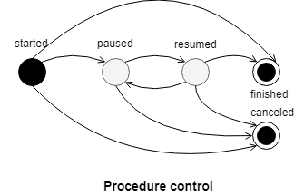
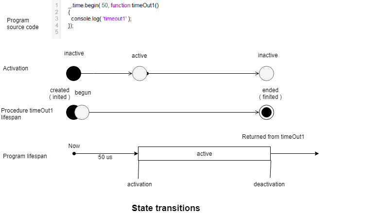

# Procedure

### Abstract

The procedure is an abstraction to span time.

Asynchronous code is the source of procedures:

- Timeout callbacks.
- Consequence/promise callbacks.
- Asynchronous callbacks.
- Semi-asynchronous callbacks.
- Subprocesses.
- Workers.

All entities producing by-products and executed non-linearly could be spanned by procedures. Tracking procedures helps to find problems in source code, gives a higher level of control of code execution. The concept of the procedure has broad application.

The procedure can have an associated object, associated routine, and wait timer. The procedure has several states. The procedure resides in one or another namespace. The narrowest is thread namespace. Procedures can be organized in a hierarchy.

Another well-known example is Windows action. Windows action is a interruptible and cancelable procedure of system-level.

### Lifespan and states

The procedure has several state automata.

Procedure lifespan is:

- Created( inited )
- Begun
- Ended( finited )

Created is the initial state and ended is the end state of the automata.

After the procedure is ended, there is no transition back.

Also, the procedure can be active or inactive.

Inactive is the initial state. Multiple transitions in both directions are possible.

Also, some procedures could expose the procedure control interface to control their execution.

Interruptible procedures allow to pause or resume them. Cancellable procedures allow to cancel them. Routines `_.time.out` and `setTimeout` are examples of cancellable procedures.

Above, you may see a diagram illustrating the transition between states. Call of `_.time.begin` creates, initializes, and begins procedure `timeOut1`. Activation of the procedure takes place 50us. Activation triggered by running callback of the timer, and after the callback is run, the procedure transits from `active` to `inactive` state after what it transits from `begun` to `ended` state. After getting in `ended` state procedure is removed from the register and is not available anymore.

### Associated object and associated routine

The procedure can have an associated routine. Running of associated routine transits the procedure from the inactive state to the active state. In the case of routine, it is its callback. There is no associated routine in the case of the subprocess. If a procedure is cancellable either interruptible, then it can have more then a single associated routine, one per each control transition.

The procedure can have an associated object. In the case of time, routine call associated object is the timer. In the case of consequence/promise method call, it could be that consequence/promise.

### Stack of active procedures

For tracking procedures activation in a semi-asynchronous code, the stack is useful. For truly asynchronous code, this stack is always going to have precisely one element because process activation cant happens while the current process is active. For semi-asynchronous code, its depth could vary.

On the diagram above you may see that activation of the callback of `_.time.out` adds element on the top of the stack of active procedures, and deactivation removes it.

Don't confuse the stack with parenting of procedures.

### Namespaces and persistence

The procedure can exist in different namespaces:

- Threat namespace.
- Process namespace.
- System namespace.
- Global namespace.

The namespace of the next level includes the namespace of the previous. Each level has its own lifespan.

The most narrow lifespan is a thread. It exists while thread runs. Process namespace includes threads namespaces. Procedures of this level exist beyond a single thread. System procedure exists even after the end of the process in which it was created. Global procedures exist beyond the local machine in the cloud.

### Hierarchy and parenting

The procedure can produce another procedure. The first one becomes the parent of the second ( child ). That relation could be accounted for too.

Logic behind parenting procedures could be similar to logic behind processes tree in unix.

### Implementation

Procedures in our implementation often have wait timer, which is required to hold exiting from the application if such procedure were not yet finished. Wait timer is a timer with infinity time out which exists while the procedure exists. In release build, we store all procedures in map with source path as key. The source path is the location where that process was created. Associated object and associated routine are stored in the procedure's structure.

Procedure activation tracking and the stack of active procedures are implemented. Procedure control is not implemented. Namespaces except for thread namespace and persistent procedures are not implemented. In our implementation, not each asynchronous callback has its own corresponding procedure.

### Application

The concept of the procedure has broad application. In the next paragraphs, few such are described.

Definition of very abstract pause/resume/cancel interface, homogenous across the application.

Managing a bunch of subtasks that could be in states: started/finished/paused. For example, test routines of test suite or tasks of continuous software development tools. If such a process is interrupted by a failure of any kind it is desirable to continue from the last running task, not from the beginning.

To determine the path to the current source file without tracing stack if `__dirname` is not available.

To monitor load and progress.

To expose events related procedure managing.

To hold exiting from the process procedure in the queue.

### Summary

- The procedure is an abstraction that makes the application more manageable and helps to find design problems.
- The procedure can be an active/inactive state.
- The procedure can be in the started/finished state. If the procedure is cancelable, it also can be in the canceled state. If the procedure is interruptible, it also can be in a paused/resumed state.
- Persistent procedures allow to continue application from point it was interrupted.
- Persistent procedures exist in the system, either global namespace.
- Procedures can be organized in a hierarchy.
