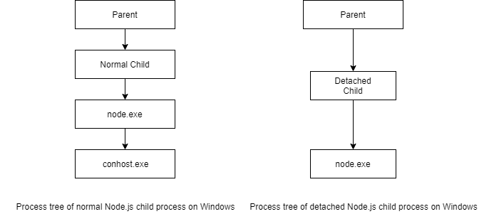

## Information about termination of Node.js child process on Windows OS

Termination - sending `SIGINT` signal to target child process using it `pid`.  
As result child process will receive `SIGINT` signal and can handle it to exit gracefully 

### Limitations

Windows does not support sending signals, but Node.js offers some emulation with process.kill(), and subprocess.kill().  
Sending signal 0 can be used to test for the existence of a process.  
Sending `SIGINT`, `SIGTERM`, and `SIGKILL` cause the unconditional termination of the target process. 

`SIGINT` signal can be listened and handled out of the box only in case when it was generated by controlling terminal.

### Solution

There is a [windows-kill](https://github.com/alirdn/node-windows-kill) module that allows sending of
`SIGINT` and `SIGBREAK` signals that can be handled by Node.js child process.

Solution works well for: 
 - Normal child process, which was created using `spawn` or `fork` modes.
 - Node.js processes started manually from console.
 
But, module doesn't work in case when child process was created in detached mode.

### Difference between normal and detached child process 

Regular child process creates additional `conhost.exe` process. 
Conhost implements `Console API` and allows Node.js to handle the signal from `windows-kill` like it was sent by controlling terminal. 
Detached child process is created without `conhost.exe` subprocess. 
Information about `conhost` can be found [here](https://devblogs.microsoft.com/commandline/windows-command-line-inside-the-windows-console).

### Further research

1. Find how to attach console to existing process.
2. Check possible solutions:
- [https://stackoverflow.com/a/12899284]([https://stackoverflow.com/a/12899284)
- [https://github.com/kettek/wprocsend](https://github.com/kettek/wprocsend)